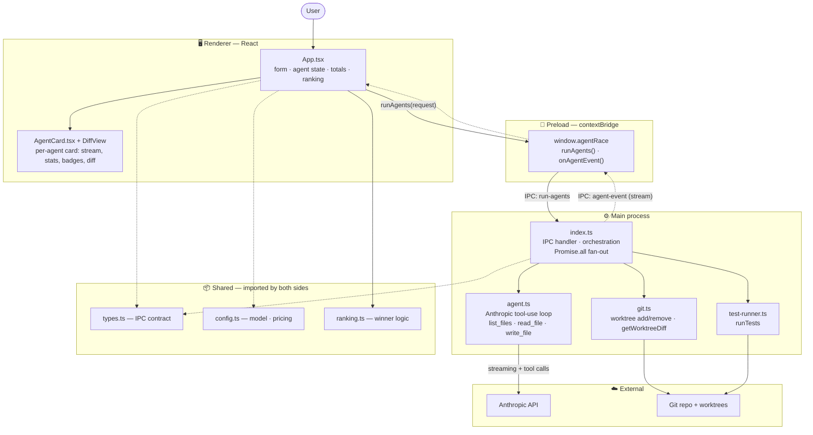
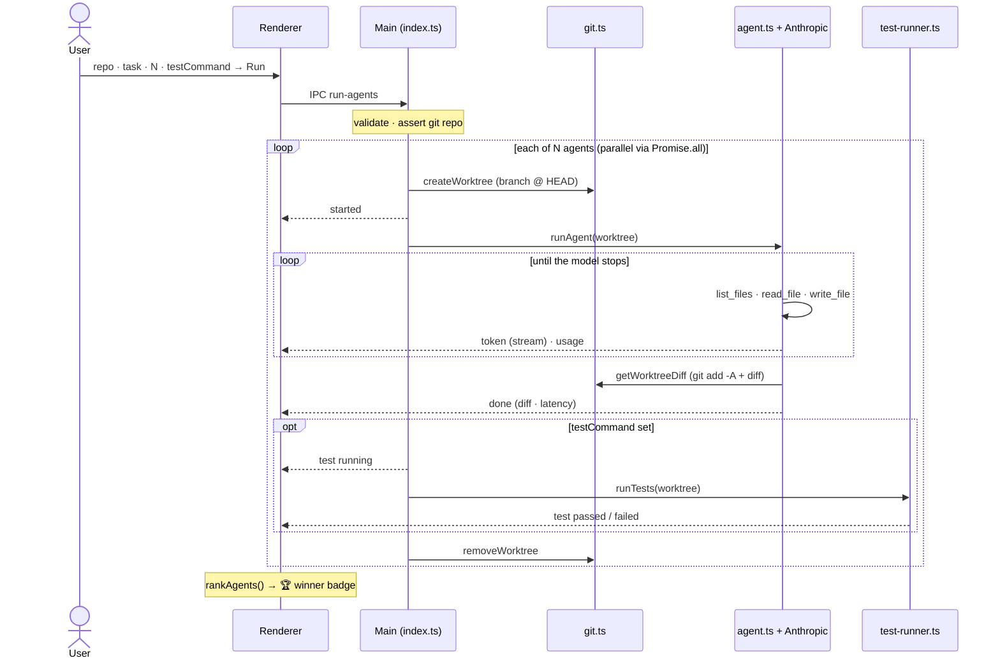

# Agent Race

Desktop app that runs **N** Anthropic coding agents in parallel on the same task. Each agent works in an isolated git worktree, streams its output live, tracks token usage and cost, and returns a **real unified diff** computed from its file changes. Optionally a test command is run in each worktree, and the agents are **ranked** to crown a winner.

## Stack

- Electron + TypeScript + React (electron-vite)
- Anthropic Messages API (`@anthropic-ai/sdk`) with streaming
- Git worktrees via `child_process` (`git worktree add` / `remove`)

## Prerequisites

- Node.js 18+
- Git
- Anthropic API key

## Setup

```bash
cd /Users/amarkulkarni/cursor_projects/agent-race
npm install
cp .env.example .env
# Edit .env and set ANTHROPIC_API_KEY
```

## Run

```bash
npm run dev
```

## Usage

1. Enter the path to a **git repository** (must have at least one commit).
2. Enter a task prompt describing what you want changed.
3. Set **N** (number of parallel agents, default 3).
4. Click **Run**.

Each agent card shows:

- Live streaming output
- Status: running / done / failed
- Latency, token count, estimated cost
- Final unified diff (when complete)

A **total cost** counter updates across all agents.

## Configuration

Edit [`src/shared/config.ts`](src/shared/config.ts):

- `MODEL` — Anthropic model name
- `COST_PER_INPUT_TOKEN` / `COST_PER_OUTPUT_TOKEN` — pricing constants for cost estimates

## Architecture

Three Electron layers (renderer ↔ preload ↔ main) plus a `shared/` module that both
sides import as the IPC contract. The renderer never touches git, the API key, or the
filesystem — it only sends a request and consumes a stream of events.



### Run lifecycle

What happens for one click of **Run**. The N agents run concurrently (`Promise.all`);
one is shown for clarity. Events stream back over IPC the whole time.



### Components

| Layer | File | Responsibility |
|-------|------|----------------|
| Renderer | `App.tsx` | Form inputs, agent state, total cost, computes ranking |
| Renderer | `AgentCard.tsx` / `DiffView.tsx` | Per-agent card: live stream, stats, rank/test badges, diff |
| Preload | `preload/index.ts` | `window.agentRace` bridge — the only renderer↔main channel |
| Main | `index.ts` | IPC handler, validation, parallel fan-out, event emit, cleanup |
| Main | `agent.ts` | Anthropic tool-use loop + sandboxed `list_files`/`read_file`/`write_file` |
| Main | `git.ts` | Worktree create/remove, real unified diff from worktree changes |
| Main | `test-runner.ts` | Runs the optional test command in a worktree (zero exit = pass) |
| Shared | `types.ts` | IPC contract: request, events, agent state |
| Shared | `config.ts` | Model id + token pricing for cost estimates |
| Shared | `ranking.ts` | Winner/rank logic: passing > untested > failing, then cost/speed/size |

## Project structure

```
src/
  main/       # Electron main — git, Anthropic, tests, IPC
  preload/    # contextBridge API
  renderer/   # React dashboard
  shared/     # types, config, ranking (IPC contract)
```

## Scripts

| Command | Description |
|---------|-------------|
| `npm run dev` | Start Electron in development |
| `npm run build` | Production build |
| `npm run preview` | Preview production build |
| `npm run typecheck` | TypeScript check |

## Out of scope (for now)

- Applying the winning diff back to the repo
- Cancelling an in-flight run
- Auth / persistence
